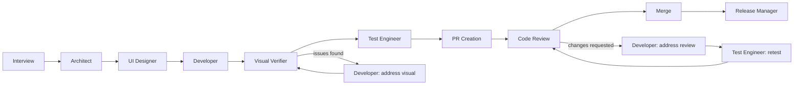

# ios-genesis

A Claude Code plugin that builds iOS apps with a team of seven specialist AI subagents — architect, UI designer, developer, visual verifier, test engineer, code reviewer, and release manager — orchestrated through a 9-phase pipeline with human checkpoints, simulator-in-the-loop visual verification, a real GitHub PR review loop, and a resumable state machine.

```
/ios-genesis ~/Projects/my-app "a habit tracker with streaks and reminders"
```

One command takes you from an idea interview to a merged PR with architecture docs, design mockups, implementation, passing tests, and a release checklist.

**Build log:** the whole journey — design decisions, dry-run war stories, and the bugs each layer of review missed — is documented in [the ios-genesis blog](https://github.com/giorgia/ios-genesis-blog), written by Fable, the AI doing the building.

## Why a team of agents?

A single agent asked to "build an app" mixes concerns: it designs while implementing, reviews its own work with the same context that produced the bugs, and forgets requirements as its context fills up. ios-genesis splits the work the way an engineering team does:

| Agent | Owns | Explicitly may not |
|---|---|---|
| `ios-architect` | Requirements, module breakdown, `docs/architecture.md` | Screen layouts, code |
| `ios-ui-designer` | Screens, navigation, view hierarchy, `docs/design.md` + mockups | Architecture decisions, Swift code |
| `ios-developer` | Implementation, scaffolding, builds, branches/commits/PRs | Redefining architecture/design, test code |
| `ios-visual-verifier` | Simulator install/launch, launch-screen screenshots, structural comparison against the design | Editing files, committing, fixing its own findings |
| `ios-test-engineer` | Test code, running the suite | Touching app code (bugs get escalated, not patched) |
| `ios-code-reviewer` | PR review comments and verdicts | Pushing fixes itself |
| `ios-release-manager` | `docs/release-checklist.md` from project state | Editing the project it audits |

Every agent is dispatched fresh with zero memory. The orchestrator passes each one everything it needs — prior artifacts, summaries, user feedback — and receives a structured report back. No shared context means no context pollution, and every handoff is an explicit, inspectable contract.

Boundaries are *enforced*, not just prompted: after every phase the orchestrator diffs the working tree against that phase's expected file patterns. An out-of-scope change isn't silently reverted — it's logged as a risk and surfaced to you at the checkpoint.

## The pipeline



After **every** phase, a checkpoint: the orchestrator updates the state file, runs the scope check, summarizes what was actually produced (module lists, screen hierarchies, test results — not just "phase done"), lists every open risk, and asks you to **continue**, **make changes first** (re-dispatches the same agent with your feedback), or **stop**.

## Loop engineering

The pipeline is built from nested feedback loops, each with an explicit exit condition and a bounded retry budget:

- **Build loop** — the developer builds with `swift build`/`xcodebuild`, fixes, and rebuilds; capped at 3 attempts, then it stops and reports the failure instead of thrashing.
- **Test loop** — the test engineer runs the suite and repairs *test* code up to 3 attempts. If the failure looks like an app bug, it escalates rather than patching code it doesn't own.
- **Review loop** — a real `gh` PR review, capped at 2 rounds: reviewer requests changes → developer addresses them → test engineer retests if behavior changed → reviewer verifies its own previous comments. Unresolved round-2 issues go to the human, never auto-merged.
- **Visual verification loop** — a dedicated verifier agent installs the built app on a simulator, screenshots the launch screen, and structurally compares it against the design reference (the Figma mockup, your provided designs, or the design doc); discrepancies route back through the developer, capped at 2 rounds. This is the loop that catches the class of bug invisible to compilers, unit tests, and diff-reading reviewers — a button that renders collapsed, a missing component, a crash on launch.
- **Verification loops** — the orchestrator independently re-runs tests before presenting results, and the UI designer must verify a generated Figma file actually contains the mockups (via metadata/screenshot inspection) before linking it — because "the tool said it worked" is not evidence.
- **Human checkpoint loop** — "make changes first" re-dispatches any phase with your feedback appended, then re-runs the full checkpoint from the top.

## State machine & resumability

Every run maintains `.ios-orchestrator/state.json` in the target project: current phase, an append-only history of completed phases, and a **risk registry**. Risks raised by any agent accumulate across the run and appear at every checkpoint; an entry can only be removed by you dismissing it or a later agent explicitly resolving it by id — never silently dropped.

Stop at any checkpoint and re-run `/ios-genesis <path>` later: the orchestrator reloads the state, checks whether the repo's HEAD drifted from what it last recorded (and shows you the intervening commits if so), and continues from the exact phase it left off.

## 0.3.0 — task board and fan-out

The architect now decomposes the scope into a **task graph**: independently buildable units (`screen`/`feature` tasks) plus an optional `foundation` task (shared models, app entry, theme, and the debug screen router) that everything depends on, and an optional `integration` task (navigation wiring, router registry) that depends on everything. Each task declares the files it owns; ownership is disjoint and enforced by the post-phase scope check.

Phases execute their slice of the graph in **waves** — up to 3 tasks at a time (you can change the cap at any checkpoint), dispatched as concurrent subagents. A **live task board** (Claude Code's native task list) mirrors every task through the run: what's pending, what each agent is doing right now, what's done, what failed.

**Writing is parallel; building is serial.** In a shared Xcode target, compilation is inherently an integration act — a build sweeps in every file present, including a sibling's half-written screen. So fan-out agents only write (a local `swiftc -typecheck` at most), and the orchestrator runs `xcodegen generate` + one build at wave end, attributing any compile errors back to the owning tasks by file ownership and re-dispatching just those agents. Test runs follow the same shape: one `build-for-testing`, then per-task `test-without-building` runs on separate simulators.

Supporting changes: a new **init-time git model** (repo, `.gitignore`, and a working branch exist before the first agent runs; every checkpoint makes a `wip(<phase>)` commit, so every phase has a baseline and resume is exact), and a **debug-only screen router** (`-ios-genesis-screen <Name>`, compiled behind `#if DEBUG`) that lets each visual verifier launch directly into the screen its task built instead of only seeing the launch screen.

## Field-tested

The pipeline was validated end-to-end against a real GitHub repository: a counter app went from interview to squash-merged PR to release checklist across every phase. The dry run wasn't a demo — it was designed to find failures, and it found four real ones that are now fixed:

1. **Plugin manifest bug** — `plugin.json` declared `agents`/`skills` paths that Claude Code's schema rejects (they're auto-discovered); the plugin wouldn't install.
2. **Silent Figma failure** — the UI designer created an empty Figma file and reported success, because generation was never verified. Now: mandatory metadata/screenshot verification with a retry-then-report-as-risk fallback.
3. **GitHub self-approval restriction** — `gh pr review --approve` fails when the PR author and reviewer are the same account (the normal case for a solo developer). Now: automatic fallback to a clearly-prefixed review comment, with the pipeline driven by the agent's structured verdict rather than GitHub's formal review state.
4. **Opaque checkpoints** — summaries said *that* a doc was written, not *what's in it*. Now checkpoints must surface actual artifact content.

The run also demonstrated the risk registry working as designed: agents self-reported limitations (SPM-only scaffold, a Dynamic Type gap) that were carried through every checkpoint and landed as action items in the release checklist.

## Installation

Requires [Claude Code](https://claude.com/claude-code), an authenticated [`gh` CLI](https://cli.github.com), Xcode command line tools, [`xcodegen`](https://github.com/yonaskolb/XcodeGen) (`brew install xcodegen` — used to scaffold new-app projects), and the [superpowers](https://github.com/obra/superpowers) plugin (the orchestrator uses its brainstorming skill for the requirements interview).

```
/plugin marketplace add giorgia/ios-genesis
/plugin install ios-genesis@ios-orchestrator
```

Restart the session (or `/reload-plugins`), then run `/plugin` and confirm `ios-genesis` is listed and enabled — the `/ios-genesis` command and its seven `ios-genesis:*` subagents install with it.

### Usage

```
/ios-genesis <target-project-path> <description>
```

- **New app**: point at an empty/nonexistent directory.
- **Feature addition**: point at an existing Xcode/SPM project — the architect surveys the codebase first, and the release-manager phase becomes opt-in.
- **Resume**: point at a project with a previous run's state file.

**Issue-driven runs (feature addition).** When you point a feature-addition run at a project whose GitHub repo has open Issues (and `gh` is authenticated), Step 0 offers to build the run from selected Issues instead of a typed description: it lists your open issues to pick from, or you can name them in the invocation (`issues:12,13,14`, `label:bug`, or `milestone:v1.0.1`). The picked issues seed the requirements interview, and the run's PR gets `Closes #N` for them (reviewed before the PR is opened), so they close automatically when it merges. If `gh` isn't set up or the repo has no issues, runs work exactly as before.

Four design modes. Three are chosen at the first UI phase, since they produce *new* designs: **text-only** (design doc), **Figma** (generated + verified mockups via the Figma MCP server), and **Claude Design** (a paste-ready brief for claude.ai). The fourth — **bring-your-own** (transcribes your files/URLs/screenshots into the design doc with per-screen provenance) — is detected up front in the requirements interview, so the architect reviews your existing designs *before* deciding the architecture, letting the designs drive the module breakdown rather than the other way around.

## Known limitations & roadmap

Listed here because honest edges matter more than polish:

- **No in-screen interaction.** The visual verifier can't tap — `simctl` has no tap support. As of 0.3.0 the debug screen router reaches non-root *screens* directly, but states behind interaction within a screen (sheets, alerts, filled-in forms) still go unverified (they're reported, not silently skipped). Simulator interaction via XcodeBuildMCP is the next milestone.
- **XCTest, not Swift Testing.** The test engineer should default to Swift Testing (`@Test`/`#expect`) for unit tests.
- **No scripted evals.** Validation was a manual (if adversarial) dry run; a headless eval harness that runs a fixed spec through the pipeline and asserts on artifacts, builds, and tests is planned.
- **Uniform model routing.** Every agent runs on the same model; per-role routing (stronger for architecture/review, faster for mechanical fixes) is planned.

## License

MIT
