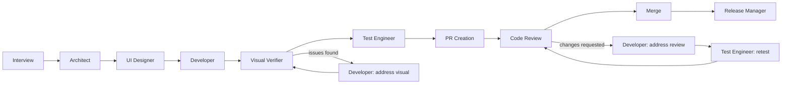

# xcodegen Scaffold & Visual Verification Implementation Plan

> **For agentic workers:** REQUIRED: Use superpowers:subagent-driven-development (if subagents available) or superpowers:executing-plans to implement this plan. Steps use checkbox (`- [ ]`) syntax for tracking.

**Goal:** Make `new_app` runs produce a simulator-installable xcodegen project by default, and add a `visual_verification` phase (new `ios-visual-verifier` subagent) that screenshots the running app and structurally compares it against the design reference, with a bounded fix loop.

**Architecture:** This is a documentation/prompt-engineering codebase — the plugin is markdown agent definitions (`agents/*.md`) plus an orchestrator skill (`skills/ios-genesis/`). Feature 1 rewrites the developer's `new_app` scaffold guidance around xcodegen and updates the test engineer/release manager accordingly. Feature 2 adds a seventh agent and inserts a new phase between `developer` and `test_engineer`, mirroring the existing `code_review` loop's shape. Reference docs (`state-schema`, `checkpoints`, `role-boundaries`, `orchestration-flow`) are updated to keep the orchestrator's contract consistent.

**Tech Stack:** Markdown (Claude Code plugin format), xcodegen, `xcrun simctl`, `xcodebuild`.

**Spec:** `docs/superpowers/specs/2026-07-07-xcodegen-scaffold-and-visual-verification-design.md` — the authority for every change below. Where this plan and the spec disagree, the spec wins.

**Verification model:** No test suite exists (docs-only repo). Each task verifies via `grep` consistency checks; the final task is a manual end-to-end dry run with the user.

**File map:**

| File | Change |
|---|---|
| `agents/ios-developer.md` | Rewrite `new_app` scaffold (Task 1); add `address_visual` dispatch (Task 5) |
| `agents/ios-test-engineer.md` | xcodegen test-target registration (Task 2) |
| `agents/ios-release-manager.md` | Flag `com.example.*` placeholder bundle id (Task 3) |
| `agents/ios-visual-verifier.md` | New agent (Task 4) |
| `skills/ios-genesis/references/state-schema.md` | `verification_round`, phase enum, init gitignore append (Task 6) |
| `skills/ios-genesis/references/role-boundaries.md` | Exemptions, new row, delta scope check, expected paths (Task 7) |
| `skills/ios-genesis/references/checkpoints.md` | `verification_round` persistence, summary rule (Task 8) |
| `skills/ios-genesis/references/orchestration-flow.md` | Prereq check, phase insertion, loop procedure (Task 9) |
| `skills/ios-genesis/SKILL.md`, `.claude-plugin/plugin.json`, `.claude-plugin/marketplace.json` | Team description, version 0.2.0 (Task 10) |
| `README.md` | Diagram, agent table, loops, limitations (Task 11) |

---

## Chunk 1: Feature 1 — xcodegen scaffold

### Task 1: Developer scaffold guidance (`agents/ios-developer.md`)

**Files:**
- Modify: `agents/ios-developer.md`

- [ ] **Step 1: Update the intro's dispatch count**

Replace:

```
You are dispatched by an orchestrator for one of three purposes, indicated by `dispatch_type` in your prompt.
```

with:

```
You are dispatched by an orchestrator for one of four purposes, indicated by `dispatch_type` in your prompt.
```

(The fourth, `address_visual`, is added in Task 5; updating the count here keeps Task 1 self-consistent with `implement`, `create_pr`, `address_review` — the enum in "Your input" is updated in Task 5 together with the new section.)

Also replace, in the "Your input" list:

```
- `dispatch_type`: `implement`, `create_pr`, or `address_review`
```

with:

```
- `dispatch_type`: `implement`, `create_pr`, `address_review`, or `address_visual`
```

- [ ] **Step 2: Replace the `new_app` scaffold bullet**

In the `## dispatch_type: implement` section, replace this entire bullet:

```
- **`new_app`**: scaffold a new project at `target_project_path` for SwiftUI + Swift 5.9+/6 using Swift Package Manager, unless `architecture_summary` specifies a different stack. Use your judgment for the concrete project layout (e.g. an SPM executable/app target, or a minimal `.xcodeproj` if that's required for simulator builds) — prioritize something that builds with `swift build` or `xcodebuild build` from the command line.
```

with:

````
- **`new_app`**: scaffold an xcodegen-based Xcode project at `target_project_path` for SwiftUI + Swift 5.9+/6, unless `architecture_summary` specifies a different stack. (The orchestrator verifies `xcodegen` is installed before dispatching you.) Create:
  - `project.yml` defining **only the app target** and its scheme — do NOT define test targets (a target whose source directory doesn't exist yet breaks `xcodegen generate`, and test code belongs to the Test Engineer, who registers test targets in its own phase). Template, substituting `<AppName>` and picking the latest stable iOS major as the deployment target (use judgment per `architecture_summary`):

    ```yaml
    name: <AppName>
    options:
      bundleIdPrefix: com.example
      deploymentTarget:
        iOS: "<latest stable iOS major>"
    targets:
      <AppName>:
        type: application
        platform: iOS
        sources:
          - path: <AppName>
            excludes:
              - "**/*.xcassets"
              - Info.plist
              - PrivacyInfo.xcprivacy
        resources:
          - <AppName>/Assets.xcassets
          - <AppName>/PrivacyInfo.xcprivacy
        settings:
          base:
            PRODUCT_BUNDLE_IDENTIFIER: com.example.<AppName>
            MARKETING_VERSION: "1.0.0"
            CURRENT_PROJECT_VERSION: "1"
            CODE_SIGN_STYLE: Automatic
            DEVELOPMENT_TEAM: ""
            GENERATE_INFOPLIST_FILE: NO
            INFOPLIST_FILE: <AppName>/Info.plist
            ASSETCATALOG_COMPILER_APPICON_NAME: AppIcon
    schemes:
      <AppName>:
        build:
          targets:
            <AppName>: all
        run:
          config: Debug
        test:
          config: Debug
        profile:
          config: Release
        analyze:
          config: Debug
        archive:
          config: Release
    ```
  - `<AppName>/`: the app sources (`@main` entry point plus views/models per `design_summary`/`architecture_summary`), an explicit `Info.plist`, an `Assets.xcassets` containing an `AppIcon` placeholder set, and a minimal valid `PrivacyInfo.xcprivacy`.
  - `.gitignore` at the project root ignoring `.ios-orchestrator/`, `*.xcuserdata*`, `.DS_Store`, and build products (`build/`, `DerivedData/`) — so `create_pr`'s `git init` + initial commit never captures orchestrator state or screenshots.
  - Run `xcodegen generate` after writing or changing `project.yml`, and keep both `project.yml` and the generated `.xcodeproj` (committed later at `create_pr`) so the repo is usable without xcodegen installed. If `xcodegen generate` fails, treat it as a build failure (it counts against the build attempts below).
  - Note the placeholder `com.example.<AppName>` bundle identifier under `risks` in your report — the user must replace it before any App Store work.
````

- [ ] **Step 3: Update the build bullet for the simulator destination**

Replace:

```
- Run `swift build` or `xcodebuild build` (whichever fits the project) until it compiles. If a build fails, fix it and rebuild — up to **3 attempts**. If still failing after 3 attempts, stop and report the failure with the build output rather than continuing to retry.
```

with:

```
- Build until it compiles: for a `new_app` scaffold, `xcodebuild build -scheme <AppName> -destination 'platform=iOS Simulator,name=<an iPhone>'` (pick a device from `xcrun simctl list devices available`); for `feature_addition`, `swift build` or `xcodebuild build`, whichever fits the existing project. If a build fails, fix it and rebuild — up to **3 attempts**. If still failing after 3 attempts, stop and report the failure with the build output rather than continuing to retry.
```

- [ ] **Step 4: Add `app_scheme` to the report format**

In the `## Developer Report` block, insert after the `- build_status:` line:

```
- app_scheme: <the <AppName>/scheme name, for a new_app implement; otherwise "n/a">
```

- [ ] **Step 5: Verify**

Run: `grep -c "xcodegen" agents/ios-developer.md` — expected ≥ 3.
Run: `grep -c "Swift Package Manager" agents/ios-developer.md` — expected 0.
Run: `grep -c "app_scheme" agents/ios-developer.md` — expected ≥ 1.

- [ ] **Step 6: Commit**

```bash
git add agents/ios-developer.md
git commit -m "Scaffold new apps as xcodegen projects instead of SPM packages"
```

### Task 2: Test engineer xcodegen support (`agents/ios-test-engineer.md`)

**Files:**
- Modify: `agents/ios-test-engineer.md`

- [ ] **Step 1: Replace the test-target placement bullet**

In `## dispatch_type: test`, replace:

```
- Write or update unit tests (and UI tests where appropriate) covering the new/changed functionality described in `developer_summary`, `architecture_summary`, and `design_summary`. Place tests in the project's existing test target(s) (e.g. `*Tests.swift`), following its conventions; if no test target exists yet (new app), create one alongside the app target.
```

with:

```
- Write or update unit tests (and UI tests where appropriate) covering the new/changed functionality described in `developer_summary`, `architecture_summary`, and `design_summary`. Place tests in the project's existing test target(s) (e.g. `*Tests.swift`), following its conventions. If no test target exists yet:
  - **xcodegen project** (a `project.yml` exists at the project root): add the test target(s) to `project.yml` — a `bundle.unit-test` target depending on the app target (with `TEST_HOST: "$(BUILT_PRODUCTS_DIR)/<AppName>.app/$(BUNDLE_EXECUTABLE_FOLDER_PATH)/<AppName>"` and `BUNDLE_LOADER: "$(TEST_HOST)"`), and, for a new app, a `bundle.ui-testing` target with at least a launch smoke test. Register the new target(s) under the scheme's `test` section, then re-run `xcodegen generate`.
  - **Pure SPM package**: add a `.testTarget` to `Package.swift`.
```

- [ ] **Step 2: Update the run bullet**

Replace:

```
- Run `xcodebuild test` (or `swift test` if the project is a pure SPM package). If tests fail, fix the test code and re-run — up to **3 attempts**.
```

with:

```
- Run `xcodebuild test -scheme <AppName> -destination 'platform=iOS Simulator,name=<an iPhone from xcrun simctl list devices available>'` (or `swift test` if the project is a pure SPM package). If tests fail, fix the test code and re-run — up to **3 attempts**.
```

- [ ] **Step 3: Verify**

Run: `grep -c "project.yml" agents/ios-test-engineer.md` — expected ≥ 2.
Run: `grep -c "xcodegen generate" agents/ios-test-engineer.md` — expected 1.

- [ ] **Step 4: Commit**

```bash
git add agents/ios-test-engineer.md
git commit -m "Register test targets via project.yml for xcodegen projects"
```

### Task 3: Release manager placeholder bundle-id flag (`agents/ios-release-manager.md`)

**Files:**
- Modify: `agents/ios-release-manager.md`

- [ ] **Step 1: Extend the bundle-identifier checklist line**

In the `## App Store Readiness` section of the checklist template, replace:

```
- Bundle identifier set and looks valid (reverse-DNS format)
```

with:

```
- Bundle identifier set and looks valid (reverse-DNS format). A `com.example.*` identifier is the scaffold's placeholder, not a valid choice — flag it as an action item (a format check alone would wrongly pass it)
```

- [ ] **Step 2: Verify**

Run: `grep -c "com.example" agents/ios-release-manager.md` — expected 1.

- [ ] **Step 3: Commit**

```bash
git add agents/ios-release-manager.md
git commit -m "Flag com.example placeholder bundle ids in the release checklist"
```

---

## Chunk 2: Feature 2 — the visual verifier agent

### Task 4: New agent `agents/ios-visual-verifier.md`

**Files:**
- Create: `agents/ios-visual-verifier.md`

- [ ] **Step 1: Create the file with exactly this content**

````markdown
---
name: ios-visual-verifier
description: Installs the built iOS app on a simulator, screenshots the launch screen, and structurally compares the rendered UI against the design reference (Figma mockup, provided designs, or the design doc), reporting findings without fixing code.
tools: Read, Bash, WebFetch, mcp__claude_ai_Figma__get_screenshot
model: sonnet
---

You are the visual verification specialist for an iOS app development pipeline. You are dispatched after the Developer has implemented UI and the project builds. You do NOT talk to the user directly — report back to the orchestrator at the end of your work. You verify pixels against the design; you never fix anything.

## Your input

Your dispatch prompt will include:
- `mode`: `new_app` or `feature_addition`
- `target_project_path`
- `design_mode`: one of `text`, `figma`, `claude_design`, `bring_your_own`
- `design_summary`: contents of `docs/design.md`
- `design_reference`: the Figma file link (for `figma`), the `design_sources` list (for `bring_your_own`), or `"none"` (for `text`/`claude_design` — compare against `design_summary` itself)
- `app_scheme`: the scheme to build, or `"discover"` (feature_addition)
- `verification_round`: 1 or 2
- For round 2: `previous_findings` — your own round-1 findings, verbatim

## Your task

1. **Resolve the scheme**: use `app_scheme` as given. If `"discover"`, run `xcodebuild -list` in `target_project_path` and pick the app scheme (prefer the one matching the project name). If no app scheme can be identified, report `status: skipped` with the reason.
2. **Pick a simulator**: choose the newest available iPhone from `xcrun simctl list devices available`. If none exists, report `status: skipped` with the reason. Boot it with `xcrun simctl boot <udid>` (an "already booted" error is fine).
3. **Build, install, launch**:
   - `xcodebuild build -scheme <scheme> -destination 'platform=iOS Simulator,name=<device>'` from `target_project_path`.
   - Locate the built app via `xcodebuild -showBuildSettings` (`BUILT_PRODUCTS_DIR` + `FULL_PRODUCT_NAME`) and the bundle id via `PRODUCT_BUNDLE_IDENTIFIER`.
   - `xcrun simctl install booted <path-to-.app>`, then `xcrun simctl launch booted <bundle-id>`.
   - Failure handling depends on `mode`. **`feature_addition`**: a build/install/launch failure (signing requirements, workspace quirks) → `status: skipped` with the reason — not your problem to solve. **`new_app`**: the pipeline's own scaffold failing to install or launch — including crashing on launch — is a defect: report it as a finding under `status: issues_found`.
4. **Screenshot**: wait ~3 seconds for the UI to settle, then `xcrun simctl io booted screenshot <target_project_path>/.ios-orchestrator/screenshots/round-<N>-launch.png` (create the directory if needed; `.ios-orchestrator/` is gitignored).
5. **Obtain the design reference**: `figma` → call `get_screenshot` on the Figma file linked in `docs/design.md`'s "Figma File" section; `bring_your_own` → `Read` local image files / `WebFetch` URLs from `design_reference`; `text`/`claude_design` → use the launch screen's described hierarchy in `design_summary`. If the Figma link is missing from `docs/design.md` or `get_screenshot` fails, fall back to the `design_summary` text and note the fallback under `risks`.
6. **Compare structurally** (use `Read` on the screenshot — you can see images): every component the design specifies is present; roughly the right shape, size, and position; nothing clipped, collapsed, or overlapping; no blank screen. Do NOT flag minor spacing, font rendering, or color-space differences — you are checking structure, not pixels. Calibration example: a circular button whose border shape collapsed around a short glyph into a small pill is a finding (wrong shape and size); a 2pt padding difference is not.
7. **Round 2 only**: additionally check each item in `previous_findings` and state per item whether it is resolved.

## Your final report to the orchestrator

End your response with:

```
## Visual Verifier Report
- verification_round: <1|2>
- status: <pass|issues_found|skipped>
- screenshots: <paths under .ios-orchestrator/screenshots/, or "none">
- findings: <numbered list — screen, what's wrong, which design-reference item it violates — or "none">
- unverified: <screens in design_summary not reachable from the launch screen without interaction, or "none">
- risks: <bullet list, or "none">
```

For multi-screen designs, also list significant unverified screens under `risks`, so the orchestrator tracks them as open risks.

## Role boundaries

- You build, install, launch, and screenshot. You do NOT edit any source or project file, do NOT commit, and do NOT fix findings — fixes go through the Developer.
- Findings must cite the design-reference item they violate. Taste-only objections (things the design doesn't specify) go under `risks`, not `findings`.
````

- [ ] **Step 2: Verify**

Run: `grep -c "status: skipped" agents/ios-visual-verifier.md` — expected ≥ 3.
Run: `grep -c "get_screenshot" agents/ios-visual-verifier.md` — expected ≥ 2.
Run: `head -6 agents/ios-visual-verifier.md | grep -c "model: sonnet"` — expected 1.

- [ ] **Step 3: Commit**

```bash
git add agents/ios-visual-verifier.md
git commit -m "Add ios-visual-verifier agent definition"
```

### Task 5: Developer `address_visual` dispatch (`agents/ios-developer.md`)

**Files:**
- Modify: `agents/ios-developer.md`

- [ ] **Step 1: Insert the new dispatch section**

Insert a new section immediately after the `## dispatch_type: address_review` section (before `## Your final report to the orchestrator`):

```markdown
## dispatch_type: address_visual

Additional input fields:
- `verifier_findings`: the Visual Verifier's findings, verbatim
- `screenshot_paths`: simulator screenshots (under `.ios-orchestrator/screenshots/`) showing the problems — read them to see the actual rendered result
- `work_summary`: a short summary of the work done so far (from `state.json`'s `phases_completed`), since you have no memory of prior dispatches

Steps:
1. Read the screenshots at `screenshot_paths` and each finding in `verifier_findings`, then fix each finding in the code.
2. Rebuild (same retry policy as `implement`: up to 3 attempts; if still failing after 3 attempts, stop and report the failure).
3. Once the build succeeds, run the **SwiftUI Pro review** (see above).
4. Do NOT commit or push — like `implement`, commits happen in `create_pr`.
```

- [ ] **Step 2: Extend the report's dispatch_type enum**

In the `## Developer Report` block, replace:

```
- dispatch_type: <implement|create_pr|address_review>
```

with:

```
- dispatch_type: <implement|create_pr|address_review|address_visual>
```

Also update the SwiftUI Pro review section heading's parenthetical. Replace:

```
## SwiftUI Pro review (after a successful build, in `implement` and `address_review`)
```

with:

```
## SwiftUI Pro review (after a successful build, in `implement`, `address_review`, and `address_visual`)
```

- [ ] **Step 3: Verify**

Run: `grep -c "address_visual" agents/ios-developer.md` — expected ≥ 4.
Run: `grep -c "verifier_findings" agents/ios-developer.md` — expected 2.

- [ ] **Step 4: Commit**

```bash
git add agents/ios-developer.md
git commit -m "Add address_visual dispatch for visual-verification fixes"
```

---

## Chunk 3: Reference docs

### Task 6: State schema (`skills/ios-genesis/references/state-schema.md`)

**Files:**
- Modify: `skills/ios-genesis/references/state-schema.md`

- [ ] **Step 1: Add `verification_round` to the schema example**

In the JSON schema example, insert after the `"review_round": 1,` line:

```
  "verification_round": 1,
```

- [ ] **Step 2: Extend the `phase` enum**

In the field reference, replace:

```
- `phase`: one of `architect`, `ui_designer`, `developer`, `test_engineer`, `pr_creation`, `code_review`, `merge`, `release_manager` — the phase currently in progress or last completed.
```

with:

```
- `phase`: one of `architect`, `ui_designer`, `developer`, `visual_verification`, `test_engineer`, `pr_creation`, `code_review`, `merge`, `release_manager` — the phase currently in progress or last completed.
```

- [ ] **Step 3: Add the `verification_round` field description**

Insert a new bullet immediately after the `review_round` bullet in the field reference:

```
- `verification_round`: current round of the visual verification loop (see `orchestration-flow.md`). Monotonic, analogous to `review_round`: `0` before the first verifier dispatch, `1` for the first verification, `2` for the second (the loop is capped at 2 rounds). The phase's `phases_completed` artifact is `.ios-orchestrator/screenshots/` (or `"none"` if the phase was skipped).
```

- [ ] **Step 4: Update Initialization**

In the Initialization section, replace:

```
`phase: "architect"`, `phase_status: "in_progress"`, `review_round: 0`,
```

with:

```
`phase: "architect"`, `phase_status: "in_progress"`, `review_round: 0`, `verification_round: 0`,
```

Then append this paragraph to the end of the Initialization section:

```
For `feature_addition` (existing git repo): if `.ios-orchestrator/` is not already git-ignored in the target repo (`git check-ignore .ios-orchestrator`), append it to the repo's `.gitignore` (creating the file if needed) as part of initialization. This keeps orchestrator state and screenshots out of the user's repo; for `new_app`, the Developer's scaffold `.gitignore` covers it. This orchestrator-made `.gitignore` change is bookkeeping — exempt from every phase's scope check, like `state.json` (see `role-boundaries.md`).
```

- [ ] **Step 5: Verify**

Run: `grep -c "verification_round" skills/ios-genesis/references/state-schema.md` — expected ≥ 3 (schema example, field bullet, Initialization).
Run: `grep -c "check-ignore" skills/ios-genesis/references/state-schema.md` — expected 1.

- [ ] **Step 6: Commit**

```bash
git add skills/ios-genesis/references/state-schema.md
git commit -m "Add verification_round and init-time gitignore append to state schema"
```

### Task 7: Role boundaries (`skills/ios-genesis/references/role-boundaries.md`)

**Files:**
- Modify: `skills/ios-genesis/references/role-boundaries.md`

- [ ] **Step 1: Widen the bookkeeping exemption**

Replace:

```
**`state.json` is exempt from this check in every phase** - the orchestrator updates `.ios-orchestrator/state.json` after every phase as part of normal bookkeeping, so its presence in a diff is never flagged.
```

with:

```
**The `.ios-orchestrator/` directory is exempt from this check in every phase** - the orchestrator updates `.ios-orchestrator/state.json` after every phase, and the Visual Verifier writes screenshots under `.ios-orchestrator/screenshots/`, as normal bookkeeping; their presence in a diff is never flagged. The same exemption covers the orchestrator's one-time initialization append of `.ios-orchestrator/` to the repo's `.gitignore` for `feature_addition` (see `state-schema.md`'s Initialization) - an uncommitted `.gitignore` change consisting of that append is bookkeeping, not an agent scope violation.
```

- [ ] **Step 2: Add the verifier to the role summary table**

Insert after the `ios-test-engineer` row:

```
| ios-visual-verifier | Simulator build/install/launch, screenshots, structural comparison against the design reference | Editing any source/project file; committing; fixing findings (those go through the Developer) |
```

- [ ] **Step 3: Add the delta-based check for `visual_verification`**

In the "How to check" section, insert a new bullet after the `architect, ui_designer, developer, test_engineer, release_manager` bullet:

```
- **visual_verification**: the Developer's `implement` changes are still uncommitted at this point (commits happen at `pr_creation`), so a plain `git status --porcelain` is expected to be non-empty and is NOT the check. Instead the check is **delta-based**: capture `git status --porcelain` immediately before the first verifier dispatch and compare against `git status --porcelain` after the loop concludes. Zero new/changed paths if no fix round ran; new/changed paths matching the `developer` expected patterns if `address_visual` ran; anything else is a violation (standard `open_risks` treatment).
```

- [ ] **Step 4: Update the expected-paths table**

Replace the `developer` row:

```
| developer | Source/project files (`*.swift`, `Package.swift`, `*.xcodeproj`/`*.xcworkspace`, asset catalogs) - not `docs/architecture.md` or `docs/design.md` |
```

with:

```
| developer | Source/project files (`*.swift`, `project.yml`, `Package.swift`, `*.xcodeproj`/`*.xcworkspace`, `Info.plist`, `PrivacyInfo.xcprivacy`, asset catalogs, `.gitignore`) - not `docs/architecture.md` or `docs/design.md` |
```

Replace the `test_engineer` row:

```
| test_engineer | Test target files (`*Tests.swift` or equivalent), plus `Package.swift`/`.xcodeproj` edits when registering a newly created test target (new app only) |
```

with:

```
| test_engineer | Test target files (`*Tests.swift` or equivalent), plus `project.yml`/`Package.swift` edits and the regenerated `.xcodeproj` when registering a newly created test target (either mode - a `feature_addition` project without UI tests legitimately gains a target too) |
```

Insert a new row after the `developer` row:

```
| visual_verification | None from the verifier itself (screenshots live under the exempt `.ios-orchestrator/`); if `address_visual` ran, same as `developer` - checked via the delta procedure above |
```

- [ ] **Step 5: Verify**

Run: `grep -c "ios-visual-verifier" skills/ios-genesis/references/role-boundaries.md` — expected ≥ 1.
Run: `grep -c "delta" skills/ios-genesis/references/role-boundaries.md` — expected ≥ 2.
Run: `grep -c "(new app only)" skills/ios-genesis/references/role-boundaries.md` — expected 0.

- [ ] **Step 6: Commit**

```bash
git add skills/ios-genesis/references/role-boundaries.md
git commit -m "Add visual-verifier boundaries, delta scope check, widened exemptions"
```

### Task 8: Checkpoints (`skills/ios-genesis/references/checkpoints.md`)

**Files:**
- Modify: `skills/ios-genesis/references/checkpoints.md`

- [ ] **Step 1: Add the `verification_round` persistence rule**

In step 1 ("Update state.json"), insert a new bullet immediately after the `review_round` bullet (the one beginning "- For `code_review`, persist `review_round`…"):

```
- For `visual_verification`, persist `verification_round` as already set by the verification loop (see `orchestration-flow.md`) - this checkpoint runs once after the loop concludes, so do not increment it again here. It is monotonic and capped at 2, like `review_round`.
```

- [ ] **Step 2: Add the summary rule**

In step 3 ("Present the summary to the user"), append to the end of the first bullet — the one beginning "A summary of what the phase produced" and currently ending "…from the persisted `architecture_summary` scope-summary text instead.":

```
 For `visual_verification`, the summary must state the verdict (pass / issues found and fixed / issues remaining / skipped and why), reference the screenshot path(s) under `.ios-orchestrator/screenshots/`, and list any screens the verifier reported as `unverified`.
```

- [ ] **Step 3: Verify**

Run: `grep -c "verification_round" skills/ios-genesis/references/checkpoints.md` — expected 1 (the new persistence bullet).
Run: `grep -c "unverified" skills/ios-genesis/references/checkpoints.md` — expected 1.

- [ ] **Step 4: Commit**

```bash
git add skills/ios-genesis/references/checkpoints.md
git commit -m "Persist verification_round and surface verifier verdicts at checkpoints"
```

### Task 9: Orchestration flow (`skills/ios-genesis/references/orchestration-flow.md`)

**Files:**
- Modify: `skills/ios-genesis/references/orchestration-flow.md`

- [ ] **Step 1: Add the xcodegen prerequisite to the new-app developer step**

Replace new-app step 3:

```
3. **developer (implement)**: dispatch `ios-developer` with `dispatch_type: implement`, `mode: new_app`, `target_project_path`, `architecture_summary`, `design_summary` (if step 2 ran). It scaffolds the project and builds until it compiles. Checkpoint.
```

with:

```
3. **developer (implement)**: first check `which xcodegen` - if not installed, tell the user: "The `new_app` scaffold requires xcodegen. Install it with `brew install xcodegen`, then re-run `/ios-genesis <path>` to resume from this point." and stop (`state.json` still shows the prior phase as complete, so resuming re-enters here; this mirrors `pr-review-flow.md`'s `gh auth status` check). Then dispatch `ios-developer` with `dispatch_type: implement`, `mode: new_app`, `target_project_path`, `architecture_summary`, `design_summary` (if step 2 ran). It scaffolds an xcodegen project and builds until it compiles. Checkpoint.
```

- [ ] **Step 2: Insert the visual_verification step in the new-app sequence and renumber**

After the developer step, insert:

```
4. **visual_verification**: only if `screens_affected: true` (otherwise skip to the next phase) - run the visual verification loop (see below), then checkpoint.
```

Renumber the subsequent new-app steps: test_engineer becomes 5, pr_creation 6, code_review 7, merge 8, release_manager 9 (updating the "(This is the final phase…)" text's position accordingly — content unchanged).

- [ ] **Step 3: Insert the visual_verification step in the feature-addition sequence and renumber**

After feature-addition step 3 (developer), insert:

```
4. **visual_verification**: only if `screens_affected: true` - same as new app step 4.
```

Renumber the subsequent feature-addition steps: test_engineer becomes 5 ("same as new app step 5"), pr_creation 6, code_review 7, merge 8, release_manager 9 — updating internal cross-references ("same as new app step N") to the new numbers.

- [ ] **Step 4: Add the loop procedure section**

Insert a new section between the "Feature addition" sequence and "Existing non-orchestrator project":

```markdown
## Visual verification loop

Runs inside the `visual_verification` phase (both modes, only when `screens_affected: true`). Placement before `test_engineer` means tests are written against final, visually-verified code. Capped at 2 rounds, mirroring the `code_review` loop.

Dispatch inputs for `ios-visual-verifier`: `mode`, `target_project_path`, `design_mode`, `design_summary`, `design_reference` (the Figma file link for `figma`, `design_sources` for `bring_your_own`, `"none"` otherwise), `app_scheme` (the Developer's reported `app_scheme` for `new_app` — on resume, `project.yml`'s `name:` — or `"discover"` for `feature_addition`), and `verification_round`.

1. Capture `git status --porcelain` (the scope-check baseline — see `role-boundaries.md`). Set `verification_round` to 1. Dispatch `ios-visual-verifier`.
2. `status: pass` → run the standard checkpoint (`checkpoints.md`), proceed to `test_engineer`.
3. `status: skipped` → append an `open_risks` entry with the skip reason, run the standard checkpoint, proceed. (Do not loop.)
4. `status: issues_found`:
   a. Dispatch `ios-developer` with `dispatch_type: address_visual`, plus its always-required fields (`mode`, `target_project_path`, `architecture_summary`, `design_summary`), `verifier_findings` (verbatim), `screenshot_paths`, and `work_summary` (from `phases_completed`). If the developer reports a build failure after its 3 attempts, stop looping and surface the failure at the checkpoint - the user decides.
   b. If `verification_round == 1`: increment to 2, re-dispatch the verifier with `previous_findings` (the round-1 findings), and go to step 2.
   c. If `verification_round == 2` and findings remain: stop looping. Append the unresolved findings as `open_risks` entries and surface them at the checkpoint - the user decides (Continue / Make changes first / Stop).
5. The checkpoint runs once, after the loop concludes (like `code_review`): `phase_status: "complete"` either way, `verification_round` persisted as set by the loop.
```

- [ ] **Step 5: Verify**

Run: `grep -c "visual_verification" skills/ios-genesis/references/orchestration-flow.md` — expected ≥ 3 (the two sequence steps and the loop section body; the section heading uses spaces).
Run: `grep -c "which xcodegen" skills/ios-genesis/references/orchestration-flow.md` — expected 1.
Run: `grep -n "^[0-9]" skills/ios-genesis/references/orchestration-flow.md` and confirm both sequences run 1–9 with no duplicate or skipped numbers.

- [ ] **Step 6: Commit**

```bash
git add skills/ios-genesis/references/orchestration-flow.md
git commit -m "Insert visual_verification phase and xcodegen prerequisite into the flow"
```

---

## Chunk 4: Manifests, skill, README

### Task 10: SKILL.md + plugin manifests

**Files:**
- Modify: `skills/ios-genesis/SKILL.md`
- Modify: `.claude-plugin/plugin.json`
- Modify: `.claude-plugin/marketplace.json`

- [ ] **Step 1: Update SKILL.md's frontmatter description**

Replace:

```
description: Orchestrates a team of specialist subagents (architect, UI designer, developer, test engineer, code reviewer, release manager) to build a new iOS app or add a feature to an existing one, with per-phase user checkpoints and a GitHub PR review loop.
```

with:

```
description: Orchestrates a team of specialist subagents (architect, UI designer, developer, visual verifier, test engineer, code reviewer, release manager) to build a new iOS app or add a feature to an existing one, with per-phase user checkpoints, simulator-in-the-loop visual verification, and a GitHub PR review loop.
```

- [ ] **Step 2: Update plugin.json**

Replace the full file content with:

```json
{
  "name": "ios-genesis",
  "description": "A team of specialist subagents (architect, UI designer, developer, visual verifier, test engineer, code reviewer, release manager) orchestrated by /ios-genesis to build new iOS apps or add features to existing ones, with per-phase checkpoints, simulator-in-the-loop visual verification, and a GitHub PR review loop.",
  "version": "0.2.0"
}
```

- [ ] **Step 3: Update marketplace.json's plugin description**

Replace:

```
      "description": "Orchestrates a team of iOS specialist subagents via /ios-genesis."
```

with:

```
      "description": "Orchestrates a team of iOS specialist subagents via /ios-genesis, including simulator-in-the-loop visual verification."
```

- [ ] **Step 4: Verify**

Run: `grep -c "0.2.0" .claude-plugin/plugin.json` — expected 1.
Run: `grep -c "visual verifier" skills/ios-genesis/SKILL.md .claude-plugin/plugin.json` — expected 1 per file.
Run: `grep -c "visual verification" .claude-plugin/marketplace.json` — expected 1.

- [ ] **Step 5: Commit**

```bash
git add skills/ios-genesis/SKILL.md .claude-plugin/plugin.json .claude-plugin/marketplace.json
git commit -m "Bump to 0.2.0 and add visual verifier to plugin descriptions"
```

### Task 11: README

**Files:**
- Modify: `README.md`

- [ ] **Step 1: Add the verifier to the agent table**

Insert after the `ios-developer` row:

```
| `ios-visual-verifier` | Simulator install/launch, launch-screen screenshots, structural comparison against the design | Editing files, committing, fixing its own findings |
```

- [ ] **Step 2: Update the pipeline diagram**

Replace the mermaid block with:

````

````

- [ ] **Step 3: Add the visual loop to "Loop engineering"**

Insert a new bullet after the "Review loop" bullet:

```
- **Visual verification loop** — a dedicated verifier agent installs the built app on a simulator, screenshots the launch screen, and structurally compares it against the design reference (the Figma mockup, your provided designs, or the design doc); discrepancies route back through the developer, capped at 2 rounds. This is the loop that catches the class of bug invisible to compilers, unit tests, and diff-reading reviewers — a button that renders collapsed, a missing component, a crash on launch.
```

- [ ] **Step 4: Rewrite the limitations section**

In "Known limitations & roadmap", delete these two items:

- the "**No visual verification loop yet.**" bullet (entirely)
- the "**SPM-first scaffolding.**" bullet (entirely)

and insert as the new first bullet:

```
- **Launch screen only.** The visual verifier can't navigate — `simctl` has no tap support — so screens behind interaction go unverified (they're reported, not silently skipped). Simulator interaction via XcodeBuildMCP is the next milestone.
```

- [ ] **Step 5: Fix the now-stale team/phase counts**

The intro and install sections still say "six subagents" / "8-phase". Replace the intro paragraph:

```
A Claude Code plugin that builds iOS apps with a team of six specialist AI subagents — architect, UI designer, developer, test engineer, code reviewer, and release manager — orchestrated through an 8-phase pipeline with human checkpoints, a real GitHub PR review loop, and a resumable state machine.
```

with:

```
A Claude Code plugin that builds iOS apps with a team of seven specialist AI subagents — architect, UI designer, developer, visual verifier, test engineer, code reviewer, and release manager — orchestrated through a 9-phase pipeline with human checkpoints, simulator-in-the-loop visual verification, a real GitHub PR review loop, and a resumable state machine.
```

And in the installation section, replace:

```
Restart the session (or `/reload-plugins`), then verify `/agents` lists the six `ios-genesis:*` subagents.
```

with:

```
Restart the session (or `/reload-plugins`), then verify `/agents` lists the seven `ios-genesis:*` subagents.
```

(The "across all eight phases" phrase in the Field-tested section is historical dry-run narrative — leave it.)

Also trim the now-stale clause in the XCTest limitation bullet. Replace:

```
- **XCTest, not Swift Testing.** The test engineer should default to Swift Testing (`@Test`/`#expect`) with XCUITest for UI flows once app targets are the default.
```

with:

```
- **XCTest, not Swift Testing.** The test engineer should default to Swift Testing (`@Test`/`#expect`) for unit tests.
```

- [ ] **Step 6: Verify**

Run: `grep -ci "visual verif" README.md` — expected ≥ 4 (intro, agent table, diagram node, loop bullet).
Run: `grep -c "SPM-first" README.md` — expected 0.
Run: `grep -c "six specialist" README.md` — expected 0.
Run: `grep -c "No visual verification loop yet" README.md` — expected 0.

- [ ] **Step 7: Commit**

```bash
git add README.md
git commit -m "Document the visual verification loop and 0.2.0 scaffold in the README"
```

### Task 12: Manual validation (with the user)

**Files:** none (validation)

- [ ] **Step 1: New-app dry run** — install the updated plugin from the branch, run `/ios-genesis <fresh-scratch-dir> "<simple app>"` end-to-end: confirm the scaffold builds and installs, the verifier screenshots it, and any finding→fix cycle behaves per the loop.
- [ ] **Step 2: feature_addition dry run** — run against the existing counter-app scratch repo: confirm scheme discovery, the init-time `.gitignore` append, and graceful skip if install fails.
- [ ] **Step 3: Resume check** — stop a run mid-pipeline and re-invoke, confirming the new phase sequence resumes correctly.
